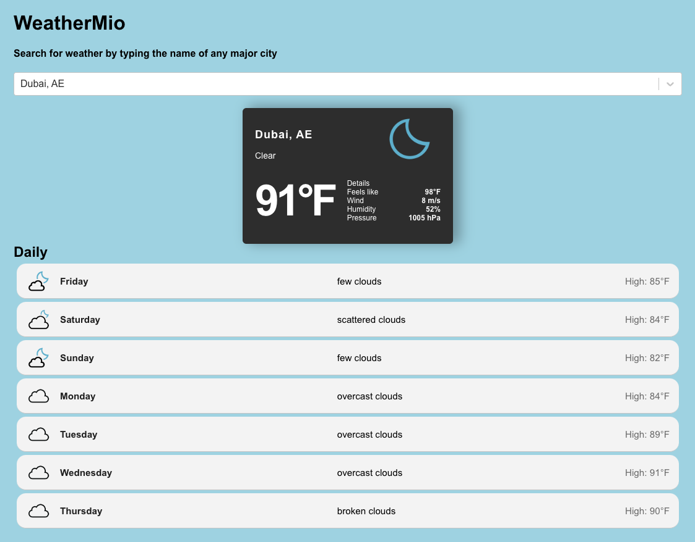

# WeatherMIO

## Features

WeatherMIO is a weather app built with React that provides you with up-to-date weather information for your selected city. Here are some of its features:

- **City Search**: WeatherMIO uses AsyncPaginate to offer suggestions as you type, making it easy to find your desired city quickly.

- **City Data**: The app utilizes the GeoDB Cities API to retrieve a list of cities matching your search in real-time.

- **Weather Forecast**: WeatherMIO connects to a Weather API to display the current weather conditions and a forecast for your selected city.

- **Educational Journey**: This project was inspired by FreeCodeCamp.org's "Build a Weather App" video tutorial. It started as a code-along with their video and has since evolved with additional features and modifications.

**Note**: The daily forecast includes the high temperature only because the API provides the same value for both high and low temperatures.

## Try It Out

Experience WeatherMIO for yourself by visiting the [WeatherMIO Website](https://kristofer11.github.io/weather-app/).
